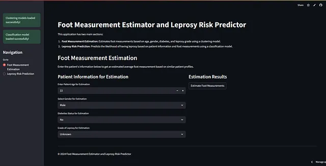
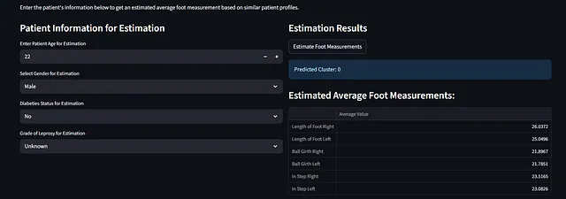
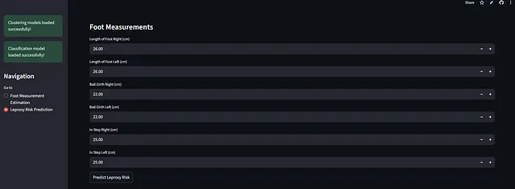
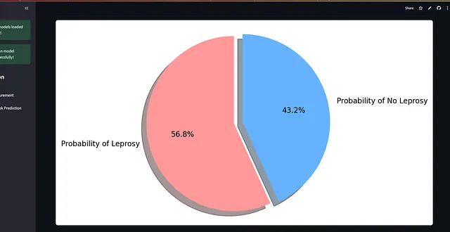

# 🦶 Leprosy Foot Measurement — Foot Measurement Estimator & Leprosy Risk Predictor

  

  <strong>Estimate original foot dimensions and predict leprosy risk using clinical data and ML (K-Means + classifier).</strong> 
  Live demo: <a href="https://leprosyfootmeasurement-6q355ryea5aqvnlnra2ddg.streamlit.app/" target="_blank">https://leprosyfootmeasurement-6q355ryea5aqvnlnra2ddg.streamlit.app/</a>  
  • Repo: <a href="https://github.com/AdityaRKori/LeprosyFootMeasurement" target="_blank">github.com/AdityaRKori/LeprosyFootMeasurement</a>

---

## Summary

**LeprosyFootMeasurement** is an applied ML project that reconstructs *likely original foot dimensions* for leprosy-affected patients and provides a leprosy-risk prediction. The system uses clustering (k-means cluster means) to estimate foot-size dimensions (length, ball girth, in-step, etc.) and a classification model to estimate leprosy probability. The model was trained on anonymized clinical data provided under research permission by Lepra India.

---

## Key features

- Estimate original foot measurements (left/right length, ball girth, in-step height) from partial/noisy inputs using cluster-based reconstruction.  
- Predict probability of leprosy given current measurements using a classification model.  
- Lightweight Streamlit UI for clinicians: enter patient age/gender/diabetes/grade of leprosy or raw foot measurements → get estimates, cluster assignment, and risk probability.  
- Visual outputs: tables and probability pie chart for easy interpretation.

---

## Ethical note & dataset

- **Dataset source:** Clinical measurements provided by Lepra India (used under research permission).  
- **Privacy:** All sensitive records were anonymized before analysis. No personally identifiable information is stored or displayed.  
- Use of this tool in clinical settings should be paired with professional medical judgement.

---

## How it works (high level)

1. **Preprocessing & clustering**
   - Clinical measurements cleaned and standardized.
   - K-means clustering used to group patient profiles; cluster means act as prototypes for reconstruction.
2. **Foot measurement estimation**
   - Given patient demographics and partial measurements, estimate full foot dimensions using nearest cluster prototype and lightweight adjustments.
3. **Leprosy risk prediction**
   - A classifier (trained on clinical labels) outputs probability of leprosy; results are shown as a probability and pie chart.
4. **App exposure**
   - Streamlit interface allows data entry and returns estimated values, predicted cluster, and risk visualization.

---

## App screenshots & explanation

> All images are referenced from the repository root (no `/images` folder). Use the exact filenames below when adding to README.

### 1) App Home / Estimation Form  
**File:** 
Shows the main two-section interface: left — patient info and parameter inputs; right — estimation results and predicted cluster.

### 2) Estimation Results (table)  
**File:**  
Displays predicted average foot measurements for left/right: length, ball girth, in-step values. Useful for clinicians to compare and record.

### 3) Manual Foot Measurement Input & Risk Prediction  
**File:**  
Manual input panel for measured values and the "Predict Leprosy Risk" action. After prediction, the app shows probability outputs.

### 4) Probability Visualization (Pie Chart)  
**File:**  
Probabilities of "Leprosy" vs "No Leprosy" displayed in a pie chart for quick interpretation. Useful when model gives a borderline score.

---

## Example user workflow

1. Clinician opens app → enters patient age, gender, diabetes status, grade of leprosy (if known).  
2. App returns a predicted cluster (patient subgroup) and estimated foot dimensions using cluster prototype means.  
3. Optionally, clinician enters measured foot dimensions (current) into the manual form.  
4. Press **Predict Leprosy Risk** → classifier outputs probability and pie chart.  
5. Clinician uses estimates and risk score alongside clinical judgement to plan footwear, prosthetics, or referrals.

---

## Evaluation & model notes

- **Clustering:** k-means with clinically validated number of clusters (tunable). Cluster centroids used as reconstruction templates.  
- **Classification model:** standard ML classifier (e.g., RandomForest/LightGBM) trained on anonymized clinical labels; outputs calibrated probabilities.  
- **Validation:** holdout evaluation and cross-validation used for stability checks. Performance metrics (accuracy, ROC AUC, precision/recall) reported in notebooks.  
- **Limitations:** model reflects training population; performance may degrade if deployed outside demographic/data distribution used for training.

---

## How to run locally

git clone https://github.com/AdityaRKori/LeprosyFootMeasurement.git
cd LeprosyFootMeasurement

python -m venv venv
# macOS / Linux
source venv/bin/activate
# Windows PowerShell
# venv\Scripts\Activate.ps1
# Windows CMD
# venv\Scripts\activate.bat

pip install -r requirements.txt
streamlit run app.py
Project structure (recommended)
LeprosyFootMeasurement/
├── app.py                     # Streamlit UI
├── model/                     # Saved clustering & classification artifacts
├── notebooks/                 # EDA, preprocessing, training notebooks
├── data/                      # Raw (if allowed) and processed datasets (anonymized)
├── requirements.txt
└── README.md

---

## Limitations & caveats
- The model is trained on a restricted clinical dataset; do not generalize outside similar populations without retraining.

- Cluster-based estimates are approximations (useful when original measurements aren't available) — always combine with clinical judgment.

- Predictions are probabilistic; use full clinical assessment for care decisions.

## Future improvements
- Incorporate 3D foot scanning comparison for validation and higher-fidelity reconstruction.

- Expand dataset with multi-region clinical data for better generalization.

- Add a guidance module to recommend footwear/prosthetics options based on predicted foot geometry.

- Improve uncertainty quantification for reconstruction (e.g., prediction intervals around estimated dimensions).

---

## Credits & contact
- **Author:** Aditya K
- **Dataset partner:** Lepra India (research permission required)
- **Live demo:** https://leprosyfootmeasurement-6q355ryea5aqvnlnra2ddg.streamlit.app/
- **Repository:** https://github.com/AdityaRKori/LeprosyFootMeasurement
- **LinkedIn:** https://www.linkedin.com/in/aditya-kori-0853b6229

---

##License
MIT License
